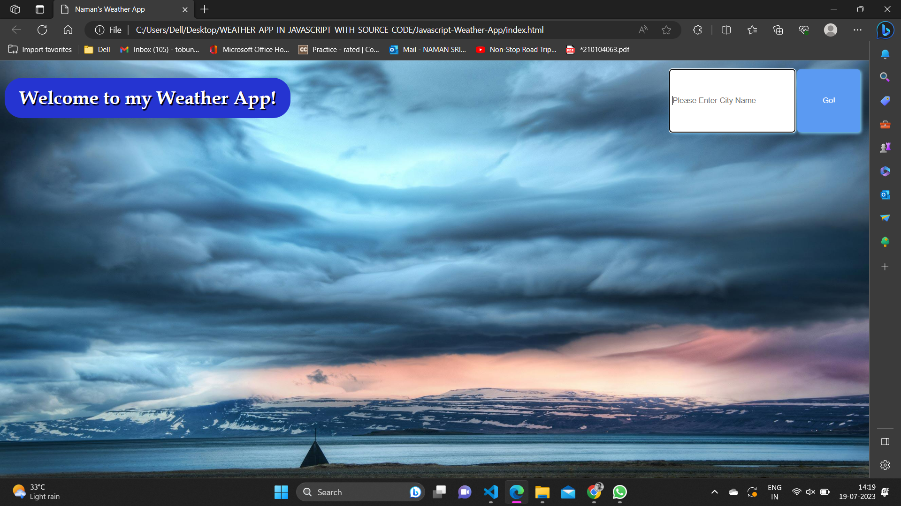
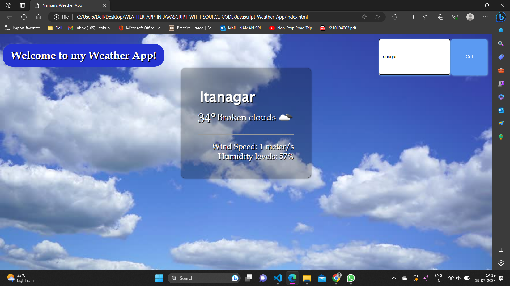
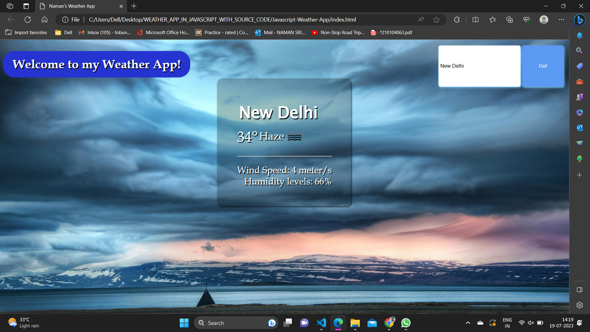
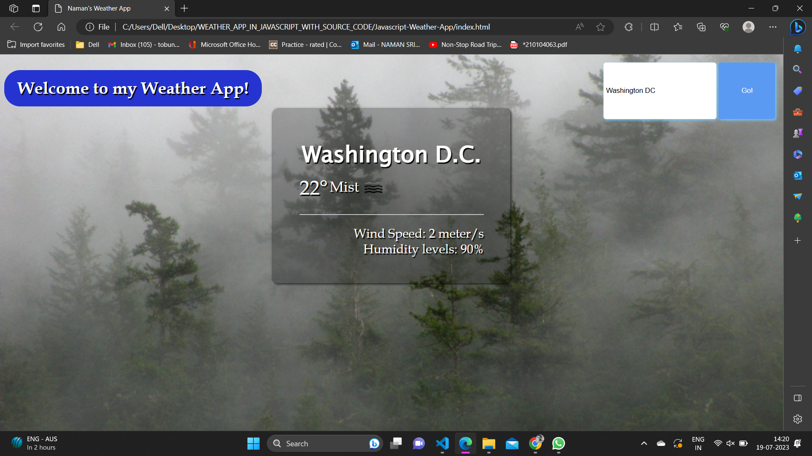
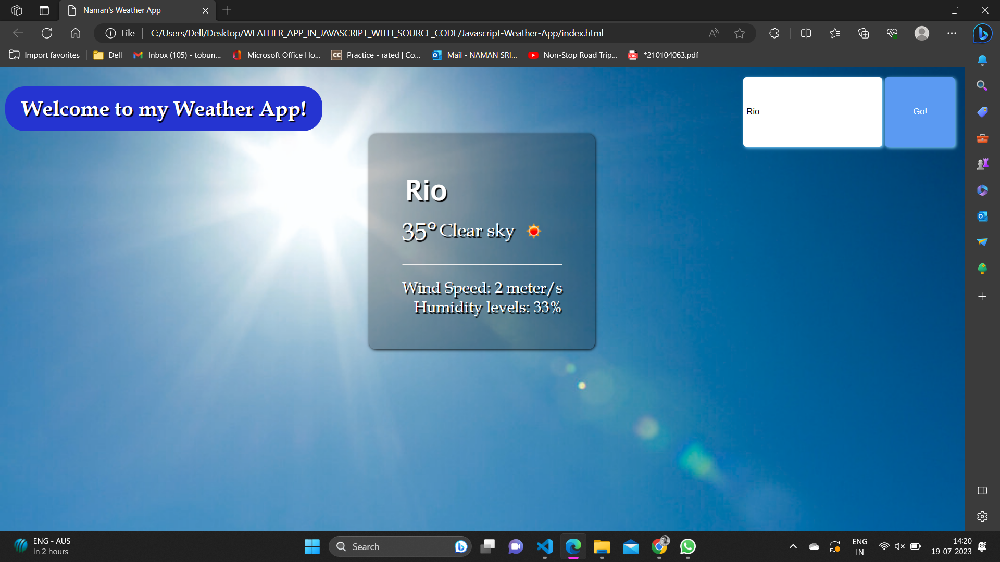

# Weather-App
Check the weather around you and all over the world at a glance.
Rely on the accurate weather forecast and adjust your schedule to the weather coming in. You won’t even have to look out the window as the app will make you feel like you are already outside!

Weather is sometimes difficult to predict. This accurate weather app allows to find out a detailed forecast wherever you are, for any time of the day by tapping on the icons:

- Just input the name of the city and get the weather information
- With the help of this application one can get the temperature of the city, behaviour of weather it is cloudy, haze, mist etc.
- Wind speed and direction
- In the background the app also shows the picture which is according to the weather

# How to use
click on the index.html to start the application and you must be connected to Internet to connext to API
Then to check weather click on the search tab and type the name of city and click on search button.

### Sample-Image

<b>Created by Naman Srivastava</b>

